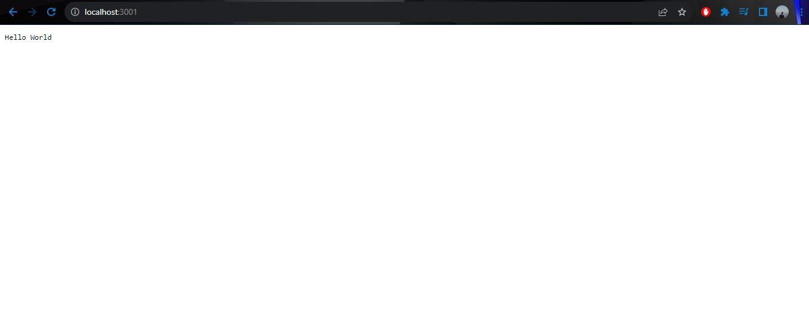

# Docker 🐋

Docker makes development efficient and predictable

Docker takes away repetitive, mundane configuration tasks and is used throughout the development lifecycle for fast, easy and portable application development – desktop and cloud. Docker’s comprehensive end to end platform includes UIs, CLIs, APIs and security that are engineered to work together across the entire application delivery lifecycle.

## Docker Image

A Docker image is a file used to execute code in a Docker container. Docker images act as a set of instructions to build a Docker container, like a template. Docker images also act as the starting point when using Docker. An image is comparable to a snapshot in virtual machine (VM) environments.

## Docker Container

A Docker container image is a lightweight, standalone, executable package of software that includes everything needed to run an application: code, runtime, system tools, system libraries and settings.

# 🔨 Installing Docker

More detailed download and install instructions can be found [here](https://docs.docker.com/get-docker/).

After done installing the Docker you can see with running `docker --version` on `CMD`, result :


# 🔨 Installing an Images
More detailed can be found [here](https://hub.docker.com/_/node) by seacrhing the node

 # ⚙️ Dockerizing a Node.js web app
## Create the Node.js app

```bash
    {
    "name": "docker_web_app",
    "version": "1.0.0",
    "description": "Node.js on Docker",
    "author": "First Last <first.last@example.com>",
    "main": "server.js",
    "scripts":{
      "start": "node server.js"
    },
    "dependencies":{
      "express": "^4.18.2"
    }
  }
```
With your new package.json file, run `npm install`. If you are using npm version 5 or later, this will generate a `package-lock.json` file which will be copied to your Docker image.

Then, create a `server.js` file that defines a web app using the Express.js framework:

```bash
const http = require('http');

const hostname = '0.0.0.0';
const port = 3001;

const server = http.createServer((req, res) => {
  res.statusCode = 200;
  res.setHeader('Content-Type', 'text/plain');
  res.end('Hello World');
});

server.listen(port, hostname, () => {
  console.log(`Server running at http://${hostname}:${port}/`);
});
```

## Create a Dockerfile

Open `Dockerfile` in your text editor

First thing we need to do is define  from what image we want to build from. Here we will use the latest version `18` of `node` available from the [Docker Hub](https://hub.docker.com/)

```bash
FROM node:18
```
Next we create a directory to hold the application code inside the image, this will be the working directory for your application:

```bash
# Create app directory
WORKDIR app
```
This image comes with Node.js and NPM already installed so the next thing we need to do is to install your app dependencies using the `npm` binary. Please note that if you are using `npm` version 4 or earlier a `package-lock.json` file will not be generated.


```bash
# Install app dependencies
# A wildcard is used to ensure both package.json AND package-lock.json are copied
# where available (npm@5+)
COPY package*.json ./

RUN npm install
# If you are building your code for production
# RUN npm ci --omit=dev
```

To bundle your app's source code inside the Docker image, use the COPY instruction:

```bash
# Bundle app source
COPY . .
```

Your app binds to port `3001` so you'll use the EXPOSE instruction to have it mapped by the `docker` daemon:

```bash
EXPOSE 3001
```

Define the command to run your app using CMD which defines your runtime. Here we will use node server.js to start your server:

```bash
CMD [ "node", "server.js" ]
```
Your Dockerfile should now look like this:

```bash
FROM node:18

# Create app directory
WORKDIR app

# Install app dependencies
# A wildcard is used to ensure both package.json AND package-lock.json are copied
# where available (npm@5+)
COPY package*.json ./

RUN npm install
# If you are building your code for production
# RUN npm ci --omit=dev

# Bundle app source
COPY . .

EXPOSE 3001

CMD [ "node", "server.js" ]
```

## Building your image
Go to the directory that has your `Dockerfile` and run the following command to build the Docker image. The `-t` flag lets you tag your image so it's easier to find later using the `docker images` command:

`docker build . -t <your username>/node-app`

Your image will now listed by Docker 

```bash
$ docker image ls

REPOSITORY   TAG       IMAGE ID       CREATED          SIZE
node_app     latest    d0383c2bc8e4   59 minutes ago   1.1GB
```
## Run the image

Running your image with `-d` runs the container in detached mode, leaving the container running in the background. The `-p` flag redirects a public port to a private port inside the container. Run the image you previously built:

```bash
docker run -d -p 3001:3001 node_app
```

## Test
To test your app, get the port of your app that Docker mapped:

```bash
$ docker ps
CONTAINER ID   IMAGE      COMMAND                  CREATED          STATUS          PORTS                    NAMES
3b29bc5ff94d   node_app   "docker-entrypoint.s…"   20 seconds ago   Up 19 seconds   0.0.0.0:3001->3001/tcp   lucid_shockley

```

Then you can open the app on the port you have created in localhost.



# Closing
 Thaks for comming. I hope you learned a thing or more  about Docker. If you found anything the be incomplete, poorly explained, or just trash. feel free to open an issue abaout it.


